# Snowflake Telemetry Dashboard Templates

[](http://www.apache.org/licenses/LICENSE-2.0.txt)

## Using Snowflake Dashboards with Grafana Cloud

1. Open a Grafana Cloud account at https://grafana.com/.
2. Create a new Grafana Cloud instance and launch it. 
    - Note: Grafana Cloud may automatically activate a 14-day free trial of Grafana Cloud. When this free trial ends, you can still use Grafana Cloud for free; however, you will be using the free version of Grafana Cloud, which still has all the features but with a few limitations (https://grafana.com/pricing/).

    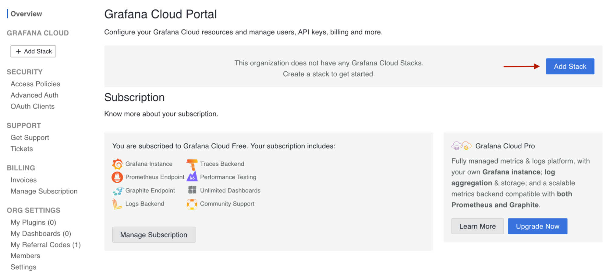
    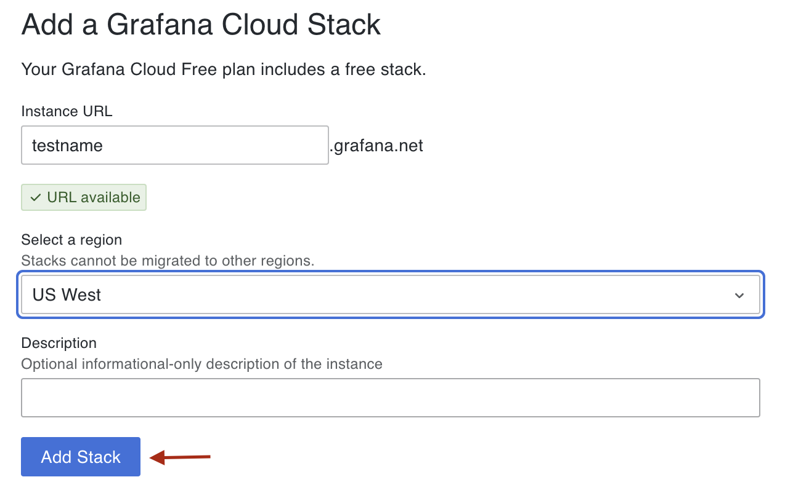
    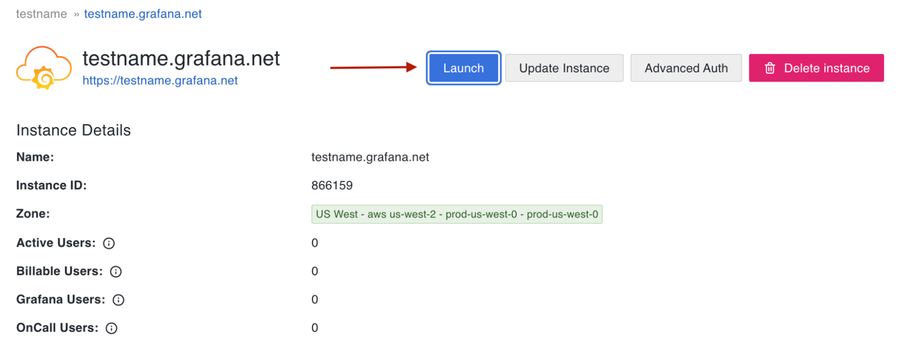
3. Install the Grafana Snowflake plug-in for your Grafana Cloud instance by navigating to https://grafana.com/grafana/plugins/grafana-snowflake-datasource/ and clicking on “Install plugin”.

    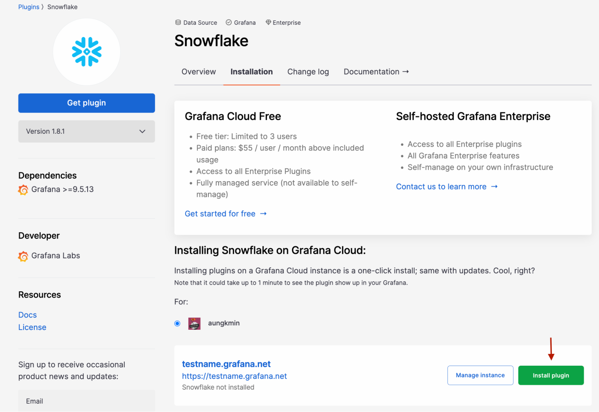
4. Add a new Snowflake datasource by following these steps: 
    - a. Go to <your_instance_name>.grafana.net. 
    - b. Navigate to Home -> Connections -> Data sources -> Add a data source. 
    - c. Search “Snowflake” in the search bar. Click on the Snowflake data source.

    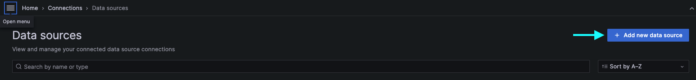
    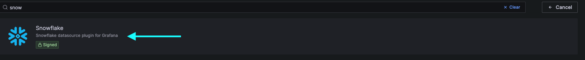
5. You’ll be presented with fields to configure your data source. Fill these in. You likely want to fill in all of the fields shown in the image below. When you’re done, click on “Save & test” at the bottom of the form. Ensure that the data source is working.

    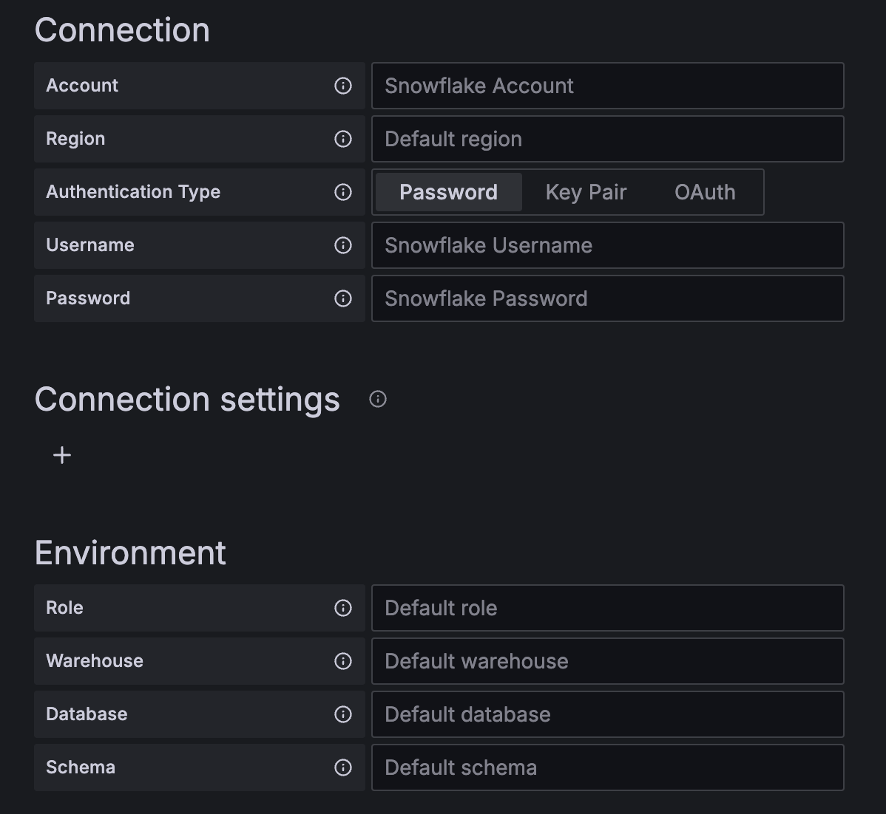
    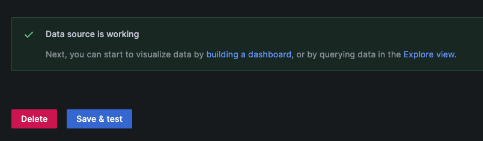
6. Navigate to Home -> Dashboards. Then go to click on New -> Import.

    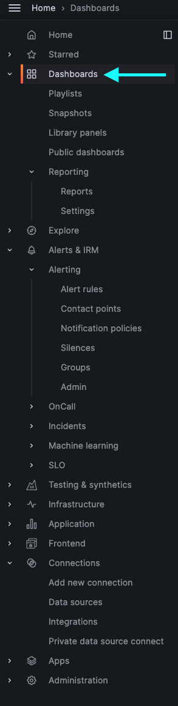
    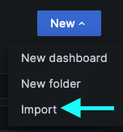
7. Copy and paste the JSON model or upload a JSON file. Then click “Load”.

    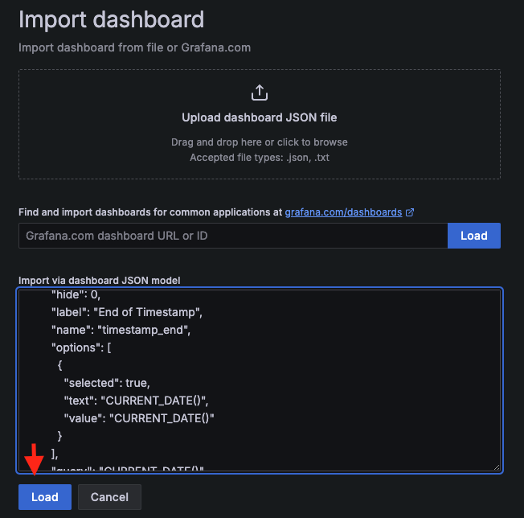
8. You can either accept the defaults for name, folder, and unique id or set your own values. For data source, select the Snowflake datasource that you just created. Then, click “Import”.

    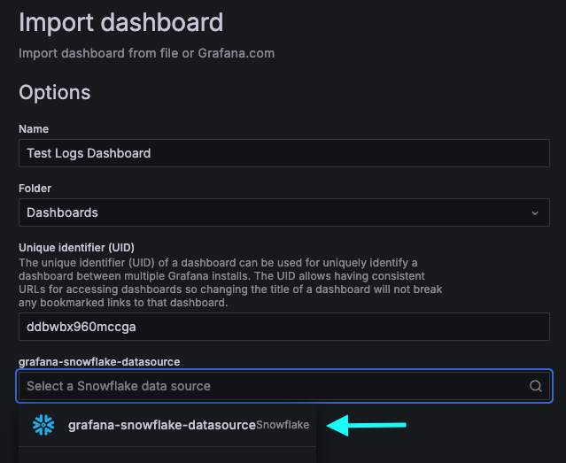
9. Populate all the required variables. For example, if your dashboard queries data from an Events Table, you must set the Event Table variable for your dashboard to display the correct data.

    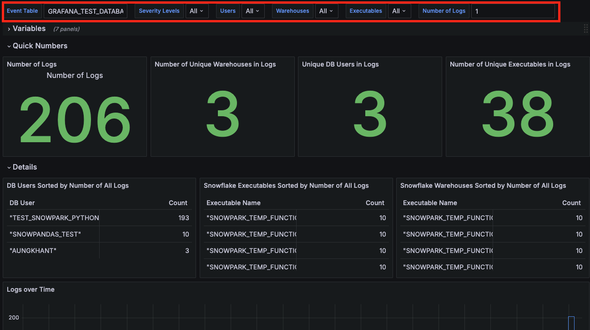
10. Set the time range of the dashboard. This time range determines the period of time that the dashboard queries from.

    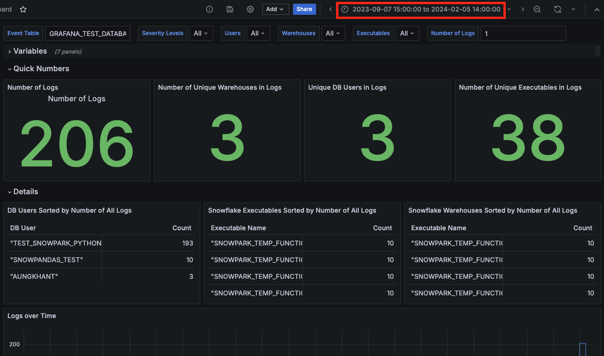

## Using Snowflake Dashboards with Grafana Open-source Running on a Local Machine

1. Create a file and name it “Dockerfile” in the current directory.
2. Copy and paste the following in the created Dockerfile. The Dockerfile, when built into an image, does the following:
    - a. base the image from the base Grafana OSS image
    - b. sets an environment variable to allow the use of the michelin-snowflake-datasource plug-in for Grafana
    - c. installs the michelin-snowflake-datasource, which allows your dashboards to connect to your Snowflake data
    - d. installs other plug-ins required for your dashboards
    
    ```docker
    ARG BASE_IMAGE=grafana/grafana-oss:latest

    FROM $BASE_IMAGE

    ENV GF_PLUGINS_ALLOW_LOADING_UNSIGNED_PLUGINS "michelin-snowflake-datasource"

    RUN grafana-cli --pluginUrl https://github.com/michelin/snowflake-grafana-datasource/releases/latest/download/snowflake-grafana-datasource.zip plugins install michelin-snowflake-datasource

    # Install any required plug-ins for your dashboard(s)
    RUN grafana-cli plugins install volkovlabs-variable-panel
    ```
3. Within your current directory, create a directory for your Grafana data.

    ```bash
    $ mkdir grafana-data
    ```
4. Build a Docker image using the Dockerfile.

    ```bash
    $ docker build --tag 'grafana-snowflake' .
    ```
5. Create a Docker container running Grafana OSS with your user id and using the previously-created data directory.

    ```bash
    $ docker run -d -p 3000:3000 --name=grafana-snowflake \
    --user "$(id -u)" \
    --volume "$PWD/grafana-data:/var/lib/grafana" \
    -e "GF_PLUGINS_ALLOW_LOADING_UNSIGNED_PLUGINS=michelin-snowflake-datasource" \
    grafana/grafana-oss
    ```
6. Ensure that the container is running (i.e. no errors occurred during startup) by running the command below and checking that you see a container that uses the image, “grafana/grafana-oss”.

    ```bash
    $ docker ps
    ```

    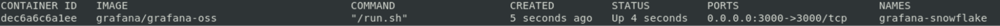
7. Visit localhost:3000 on your browser. You’ll be prompted to log in to Grafana. By default, the log-in details for the admin account is admin/admin.
8. Create a new Snowflake data source.
    - a. Navigate to Home -> Connections -> Data sources -> Add a data source. 
    - b. Search “Snowflake” in the search bar. Click on the Snowflake data source.

    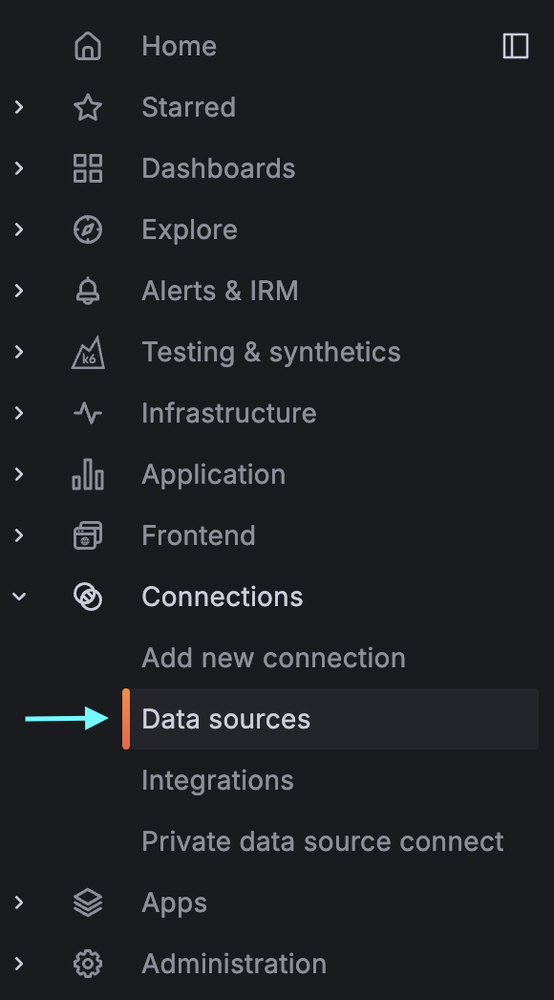
    
    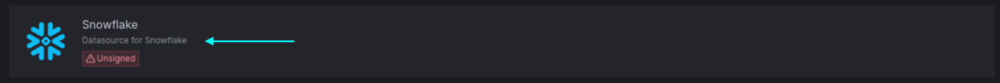
9. You’ll be presented with fields to configure your data source. Fill these in. You likely want to fill in all of the fields shown in the image below. When you’re done, click on “Save & test” at the bottom of the form. Ensure that the data source is working.

    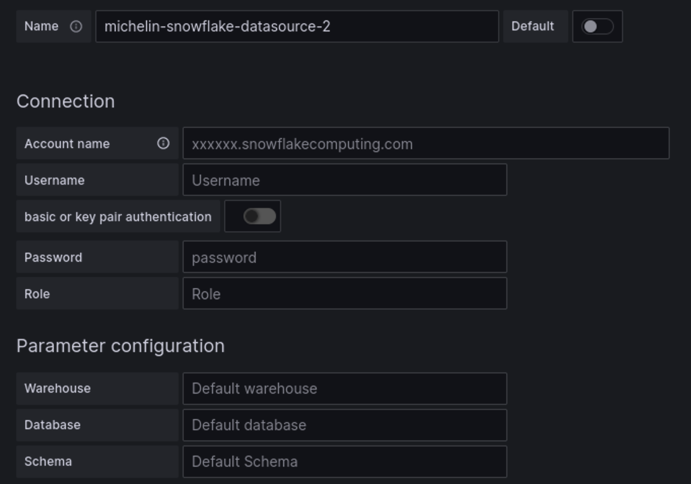
    
10. Navigate to Home -> Dashboards. Then go to click on New -> Import.

    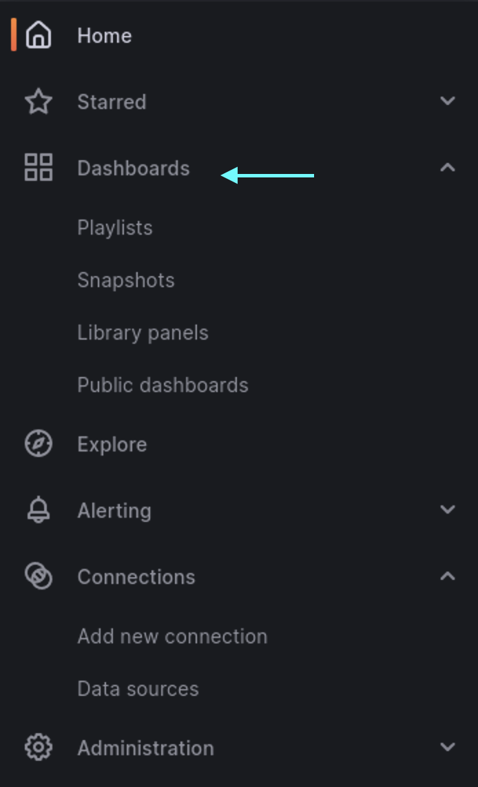
    
11. Copy and paste the JSON model or upload a JSON file. Then click “Load”.

    
12. You can either accept the defaults for name, folder, and unique id or set your own values. For data source, select the Snowflake datasource that you just created. Then, click “Import”.

    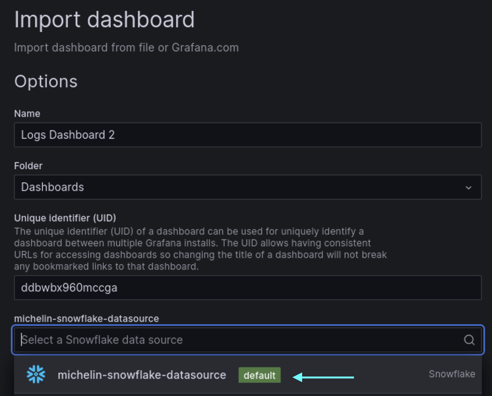
13. Populate all the required variables. For example, if your dashboard queries data from an Events Table, you must set the Event Table variable for your dashboard to display the correct data.

    
14. Set the time range of the dashboard. This time range determines the period of time that the dashboard queries from.

    